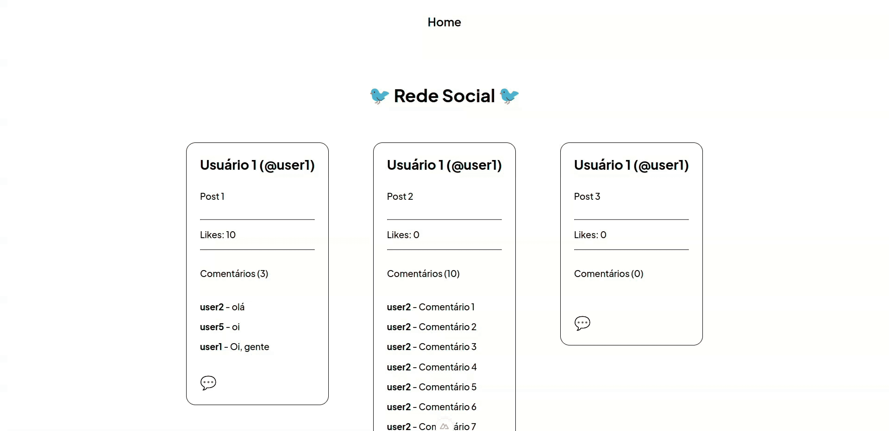

# 🕸️ Rede Social - Projeto Fullstack

Plataforma de rede social criada com Nuxt no frontend e ASP.NET Core no backend.

## 🛠️ Tecnologias Utilizadas 

- Front-end: Nuxt (Vue.js)
- Back-end: ASP.NET Core (C#)
- Banco de dados: Microsoft SQL Server
- Containerização: Docker + Docker Compose

## ✨ Funcionalidades

- Visualizar posts, comentários e quantidade de likes


- Criar comentários



> **Nota:** a rede social tem sistema aberto (o login não é obrigatório). Ou seja, para criar um comentário, é necessário usar 1 dos 10 nomes de usuários 
previamente propagados no banco de dados (`user1`, `user2`, ..., `user10`).

## ⚙️ Instalação

### 1. Pré-requisitos

- NPM ou Yarn
- Docker

### 2. Configurando o back-end (.NET)

Crie um arquivo `docker-compose.yaml` e copie o conteúdo a seguir nele:

```bash
volumes:
  social_app_data: {}

networks:
  social_app:

services:
  backend:
    image: guighm/social-app-backend:v1
    ports:
      - "5000:8080"
      - "5001:8081"
    networks:
      social_app:
    depends_on:
      - db

  db:
    image: mcr.microsoft.com/mssql/server:2022-latest
    container_name: sql1
    hostname: sql1
    ports:
      - "1433:1433"
    networks:
      social_app:
    environment:
      ACCEPT_EULA: "Y"
      MSSQL_SA_PASSWORD: "<YourStrong@Passw0rd>"
    volumes:
      - social_app_data:/var/opt/mssql
```

Rode o seguinte comando: 

```bash
docker-compose up -d
```

O banco SQL Server e o back-end serão inicializados com Docker, e o back-end automaticamente rodará as migrations e o seed.

### 3. Configurando o front-end (Nuxt)

Clone o repositório:

```bash
git clone https://github.com/guighm/social-app-vue.git
```

Acesse a pasta `social-app-vue`:

```bash
cd social-app-vue
```

Instale as dependências:

```bash
npm install 
# ou 
yarn install
```

Crie um arquivo `.env` e copie o seguinte conteúdo nele:

```
NUXT_PUBLIC_API_URL=http://localhost:5000
```

Inicie o front-end:

```bash
npm run dev 
# ou
yarn dev
```

O front-end estará disponível em:

```
http://localhost:3000
```

## 👨‍💻 Autor

<table>
  <tr>
    <td align="center">
    <a href="https://github.com/guighm">
        <br />
        <sub><b>Guilherme Moraes</b></sub>
        </a>
    </td>
  </tr>
</table>